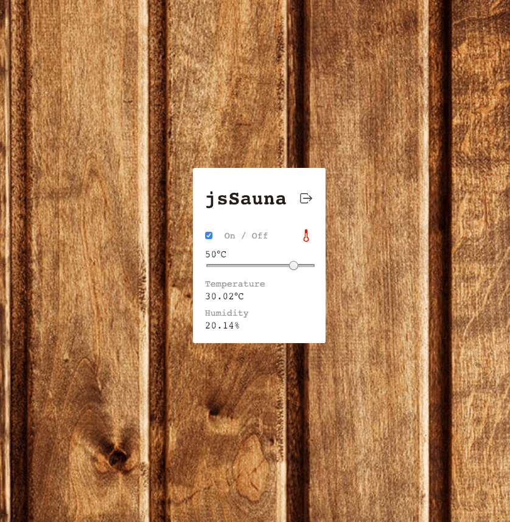

# jsSauna

[![NPM Version][npm-image]][downloads-url] [![NPM Downloads][downloads-image]][downloads-url]

**A Web Based Sauna Control System written in JavaScript**

I use this package to control my sauna with my **Raspberry pi**.
There is a solid state relay to switch the heater `On` and `Off`, as well as a `temperature` and `humidity` sensor to measure the surroundings.

- DHT Sensor: [https://www.adafruit.com/product/393](https://www.adafruit.com/product/393)
- Solid State Relay: [https://www.sparkfun.com/products/13015](https://www.sparkfun.com/products/13015)



Pick a `target temperature` and switch the sauna `On` / `Off`.

## Quick Start

Install jsSauna globally:

```bash
$ npm i -g jssauna
```

Use the new command to start an instance:

```bash
$ jssauna --rp 14 --sp 4
```

## CLI

- override default webserver port:
  - `-p PORT`
  - `--port PORT`
- override default target temperature (50°C):
  - `-t TARGET_TEMPERATURE`
  - `--target-temperature TARGET_TEMPERATURE`
- override default max temperature (60°C):
  - `-m MAX_TEMPERATURE`
  - `--max-temperature MAX_TEMPERATURE`
- **required** set solid state relay pin:
  - `--rp RELAY_PIN`
  - `--relay-pin RELAY_PIN`
- **required** set DHT sensor pin:
  - `--sp SENSOR_PIN`
  - `--sensor-pin SENSOR_PIN`
- set optional drive strength (gpio command):
  - `--drive-strength DRIVE_STRENGTH`
- set optional username for authentication:
  - `--username USERNAME`
- set optional password for authentication:
  - `--pw PW`

## Installation

As dependency:

```sh
$ yarn add jssauna
```

Play around and contribute to the project:

```sh
$ git clone https://github.com/ardean/jsSauna
$ cd jsSauna
$ yarn
$ yarn start
```

## Production

I'm using [pm2](https://www.npmjs.com/package/pm2) on my production system to start jsSauna.

Make sure you install jsSauna with all optional dependencies!
Otherwise you will use **testdata** for the sensors and On / Off requests will be **ignored** for the relay!

### Troubleshooting

If you have problems installing jsSauna globally as root using `sudo npm i -g jssauna`, you can try the option `--unsafe-perm`.

## TODO

- API Documentation
- Support multiple Relays
- Support more and multiple DHT sensors

## License

[MIT](LICENSE)

[downloads-image]: https://img.shields.io/npm/dm/jssauna.svg
[downloads-url]: https://npmjs.org/package/jssauna
[npm-image]: https://img.shields.io/npm/v/jssauna.svg
[npm-url]: https://npmjs.org/package/jssauna
